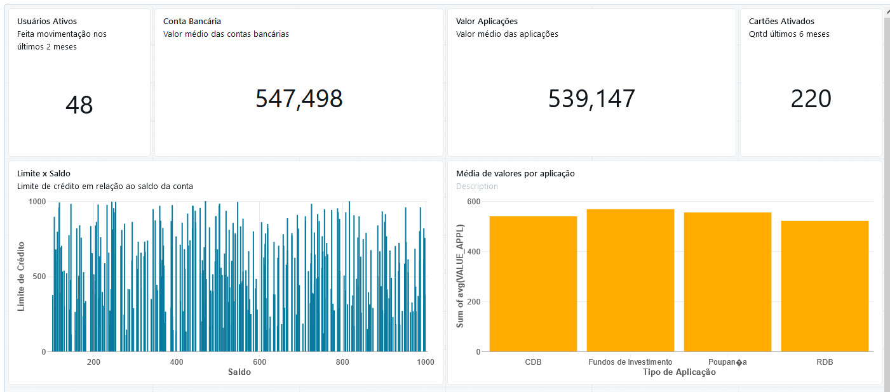

# Apresentação

## KPIs (Key Performance Indicators)

Os KPIs são métricas essenciais derivadas dos dados processados que ajudam a monitorar e avaliar o desempenho da organização. Utilizando o modelo OBT, é possível calcular e analisar diversos KPIs de maneira eficiente, garantindo uma visão clara e precisa dos aspectos críticos do negócio. Os KPIs utilizados incluem:

- **Usuários Ativos:** Número de usuários que fizeram movimento na conta nos últimos dois meses.
- **Valor Médio das Contas Bancárias:** Média do saldo das contas bancárias dos usuários.
- **Valor Médio das Aplicações:** Média dos valores aplicados pelos usuários.
- **Cartões Ativados:** Quantidade de cartões ativados nos últimos seis meses.

## Métricas

As métricas complementam os KPIs, fornecendo dados adicionais para análises mais detalhadas e específicas. As métricas utilizadas incluem:

- **Limite do Cartão x Saldo da Conta:** Comparação entre o limite dos cartões e o saldo das contas.
- **Média de Valores por Aplicação:** Média dos valores investidos em cada aplicação.

## Dashboard - Databricks

Os dados transformados no modelo OBT são utilizados para alimentar um dashboard interativo. Este dashboard permite visualizações avançadas e oferece uma ferramenta poderosa para a análise de dados e suporte à tomada de decisões. Com ele, é possível:

- Monitorar KPIs em tempo real.
- Visualizar tendências e padrões através de gráficos e tabelas.
- Realizar análises comparativas e detalhadas.
- Facilitar a comunicação de insights e resultados para a equipe e stakeholders.

## Conclusão

O pipeline descrito assegura que os dados sejam processados de maneira eficiente e organizada, começando com a coleta de dados não estruturados do MongoDB, passando por várias camadas de refinamento e enriquecimento (landing, bronze, silver) e resultando na camada Gold, no formato OBT.

Essa abordagem facilita a criação de dashboards dinâmicos, proporcionando uma ferramenta poderosa para a tomada de decisões baseada em dados. A arquitetura Medalhão, aliada ao modelo OBT, garante que os dados sejam precisos, consistentes e prontos para análises detalhadas, contribuindo significativamente para o sucesso da organização.