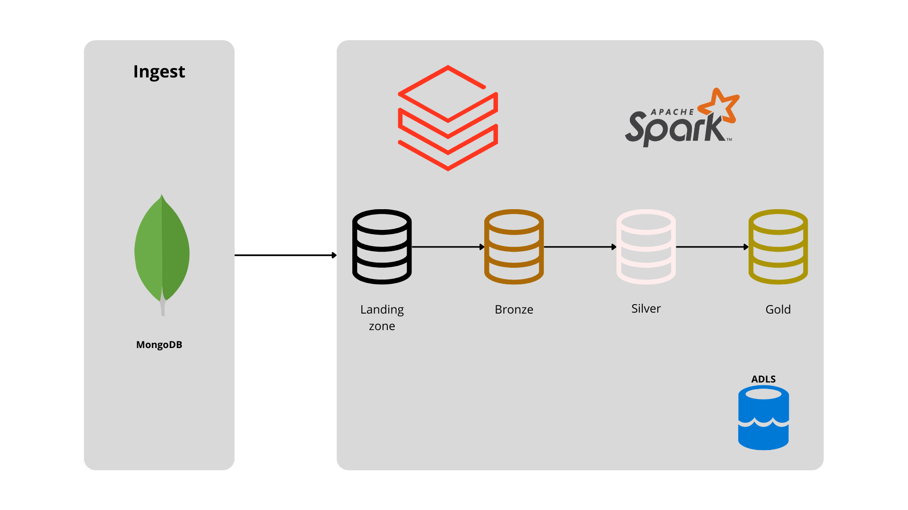

---
hide:
  - navigation
---

# Introdução

### O que é o sistema?

O sistema de conta digital é uma plataforma desenvolvida para oferecer uma experiência completa de gestão financeira pessoal através de uma interface digital. Ele permite aos usuários realizar operações bancárias como pagamentos, transferências, consultas de saldo, solicitação de cartões e empréstimos de maneira conveniente e segura.

### Objetivos

Os principais objetivos do sistema são:

- **Facilitar o acesso aos serviços bancários**: Proporcionar uma experiência digital intuitiva e acessível para realização de operações financeiras.
- **Oferecer produtos financeiros integrados**: Disponibilizar produtos como cartões de crédito, investimentos e empréstimos de forma integrada.
- **Garantir segurança e privacidade**: Implementar medidas robustas para proteger os dados pessoais e financeiros dos usuários.

### Funcionalidades Principais

- **Gestão de Contas**: Abrir contas, consultar extratos e realizar operações bancárias básicas.
- **Produtos Financeiros**: Oferta de produtos como cartões de crédito, aplicações financeiras e empréstimos.
- **Segurança Avançada**: Medidas de segurança para proteger informações sensíveis dos usuários.

### O que é um Pipeline?

Um pipeline de dados é uma arquitetura que permite a automatização e organização do fluxo de dados dentro de um sistema. No contexto deste projeto, utilizamos a arquitetura de pipeline Medalhão, que processa dados em diferentes camadas (landing, bronze, silver, gold), garantindo assim a integridade e a qualidade dos dados ao longo de todo o processo.

### Benefícios do Uso de Pipelines

O uso de pipelines de dados oferece benefícios significativos para o sistema de conta digital, incluindo:

- **Automatização de Processos**: Redução da necessidade de intervenção manual, o que aumenta a eficiência operacional.
- **Organização Estruturada**: Facilita o gerenciamento e a manutenção do fluxo de dados em etapas claras e definidas.
- **Melhoria da Qualidade dos Dados**: Garante que os dados sejam tratados e transformados de maneira consistente, melhorando a confiabilidade das informações disponíveis para os usuários.

### Dashboard Analítico

O resultado final do pipeline é um dashboard analítico que fornece insights valiosos para a empresa. Este dashboard não é acessado diretamente pelos clientes, mas sim utilizado internamente para analisar dados, gerar insights estratégicos e tomar decisões informadas que ajudem a empresa a evoluir e aprimorar seus serviços.

### Tecnologias Utilizadas

Para atingir esses objetivos, o sistema utiliza uma combinação de tecnologias modernas:

- **MongoDB**: Banco de dados não relacional para armazenamento inicial de dados.
- **Databricks**: Plataforma para processamento e análise de big data.
- **SQL Server**: Banco de dados relacional para armazenamento de dados estruturados e críticos.

Esta introdução oferece uma visão clara sobre as funcionalidades e objetivos do sistema de conta digital, destacando o papel essencial do dashboard analítico para fornecer insights estratégicos aos gestores da empresa.