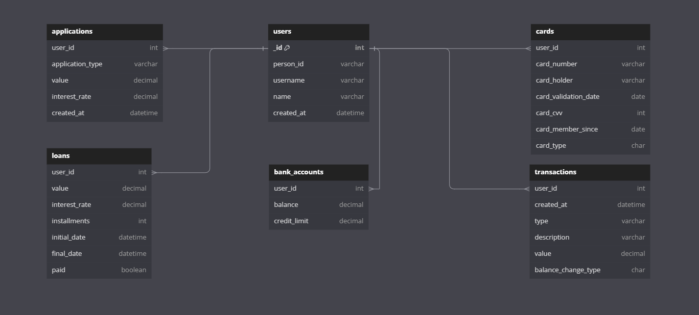

# Introdução

### O que é o sistema?

Este projeto foi desenvolvido para a disciplina de Engenharia de dados, com o objetivo de construir um pipeline de dados completo para uma aplicação de conta digital, o qual é uma plataforma desenvolvida para oferecer uma experiência completa de gestão financeira pessoal através de uma interface digital. Ele permite aos usuários realizar operações bancárias como pagamentos, transferências, consultas de saldo, solicitação de cartões e empréstimos de maneira conveniente e segura.

### Colaboração

1. Crie um novo repositório vazio no GitHub.
2. No terminal, navegue até o diretório raiz do projeto.
3. Execute os seguintes comandos:

``` bash
  git remote set-url origin https://github.com/seu-usuario/nome-do-novo-repositorio.git
  git add .
  git commit -m "Adicionar minhas modificações"
  git push -u origin master
```

### Tecnologias Utilizadas

Para atingir esses objetivos, o sistema utiliza uma combinação de tecnologias modernas:

- **MongoDB**: Banco de dados não relacional para armazenamento inicial de dados.
- **Python** - Usado para criar o script para as informações do banco.
- **VSCode** - IDE ultilizada para o desenvolvimento em python.
- **Databricks**: Plataforma para processamento e análise de big data.
- **MKdocs** - Programa ultilzado para documentação do projeto.

### Pipeline Construído


O processo conta com os componentes:

1. **Ingestão (Ingest):** MongoDB: É a fonte inicial dos dados. MongoDB é um banco de dados NoSQL, adequado para armazenar grandes volumes de dados semi-estruturados.

2. **Landing Zone:** Os dados são inicialmente ingeridos na Landing Zone. Esta zona é utilizada para armazenar dados brutos conforme são recebidos, sem qualquer processamento ou transformação.

3. **Bronze Zone:** Nesta etapa, os dados brutos da Landing Zone são copiados ou movidos para a Bronze Zone. Esta zona ainda contém dados relativamente não processados, mas pode incluir alguma limpeza básica.

4. **Silver Zone:** Na Silver Zone, os dados são transformados e limpos. Esta etapa pode incluir remoção de duplicatas, correção de erros e outras transformações que preparam os dados para análise. Os dados aqui são mais refinados do que na Bronze Zone.

5. **Gold Zone** A Gold Zone contém dados altamente refinados e prontos para consumo por aplicativos de análise ou relatórios. Nesta etapa, os dados estão em seu formato mais utilizável e confiável.

6. **ADLS (Azure Data Lake Storage)** O ADLS é usado como armazenamento final para os dados processados. Ele pode armazenar grandes volumes de dados em diferentes estados de processamento e é bem integrado com o ecossistema Databricks e Spark.

### Banco de Dados

A estrutura inicial do banco de dados contém 6 tabelas, conforme diagrama:

